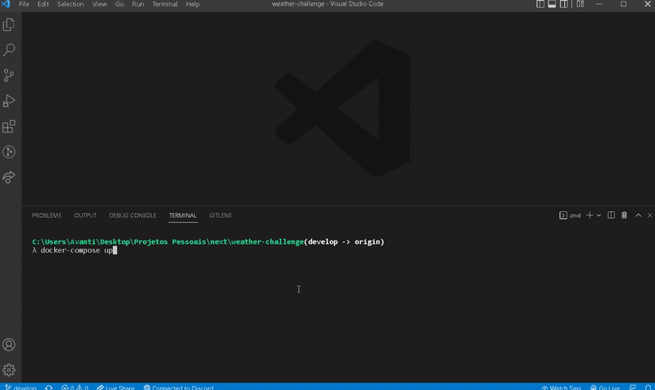

<h1 align="center">
  🌈 WEATHER CHALLENGE
</h1>

<p align="center">
  
  
  
  
  
</p>

## 💻 Sobre

Projeto realizado para teste de Front-End. O objetivo da aplicação é criar uma página que, ao escolher uma cidade, leia as informações do clima dela através de uma API.

<h4 align="center">Layout (invision): <a href="https://explosion.invisionapp.com/public/share/SX19J12TJR#screens/476656918">https://explosion.invisionapp.com/public/share/SX19J12TJR#screens/476656918.</a></h4>

<p align="center">
  
</p>

<h4 align="center"><a href="https://weather-tds.vercel.app/">Clique aqui para ver o projeto no vercel.</a></h4>

---

<h4 align="center">API utilizada no projeto: <a href="https://www.weatherapi.com/">https://www.weatherapi.com/</a></h4>

---

### 🚀 Tecnologias

O projeto foi desenvolvido com as seguintes tecnologias:

- [NextJS](https://nextjs.org/)
- [TypeScript](https://www.typescriptlang.org/)
- [SASS](https://sass-lang.com/)
- [Jest](https://jestjs.io/)
- [React Testing Library](https://testing-library.com/docs/react-testing-library/intro)
- [classnames](https://www.npmjs.com/package/classnames)
- [Eslint](https://eslint.org/)
- [Prettier](https://prettier.io/)
- [Husky](https://github.com/typicode/husky)
- [Axios](https://axios-http.com/)
- [Docker](https://www.docker.com/)
- [framer-motion](https://www.framer.com/motion/)

---

### ▶️ Executando o projeto

Siga os seguintes passos para poder utilizar a aplicação em sua máquina.

1. Clone a aplicação em sua máquina local com os seguintes comandos:

```bash
git clone https://github.com/micheldslive/weather-challenge.git
```

2. Depois, vá até o diretório do seu projeto utilizando o comando

```bash
cd weather-challenge
```

3. Instale as dependências:

```bash
yarn install
# ou
npm install
```

4. Rode sua aplicação em sua [conexão local](http://localhost:3000)

```bash
npm run dev
# ou
yarn dev
```

---

## ▶️ Executando o projeto (Docker)

##### Com o Docker devidamente instalado e o repositório Clonado, Execute o comando abaixo:

```
docker compose up
```

<p align="center">
  
</p>

---

### 📚 Testes

Para realizar os testes rode os seguinte comando

```bash
npm run test
# ou
yarn test
```

---

## Desenvolvedor<br>

<table>
  <tr>
    <td align="center">
      <a href="https://github.com/micheldslive">
        <br>
        <sub>
          <b>Michel Domingos</b>
        </sub>
      </a>
    </td>
  </tr>
</table>

### 🖊️ Licença

O projeto é licenciado sobre a "MIT License" - Veja a pagina LICENÇA para mais destalhes.
